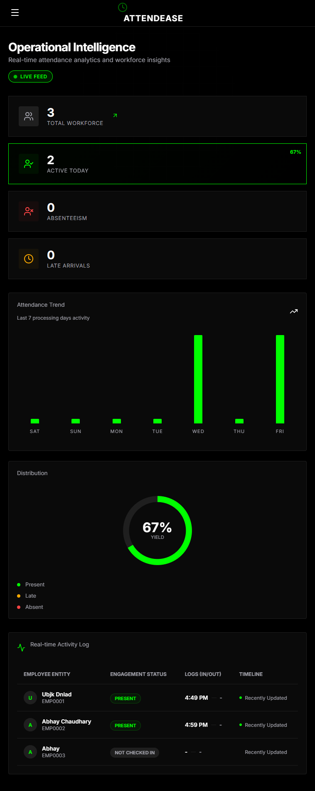
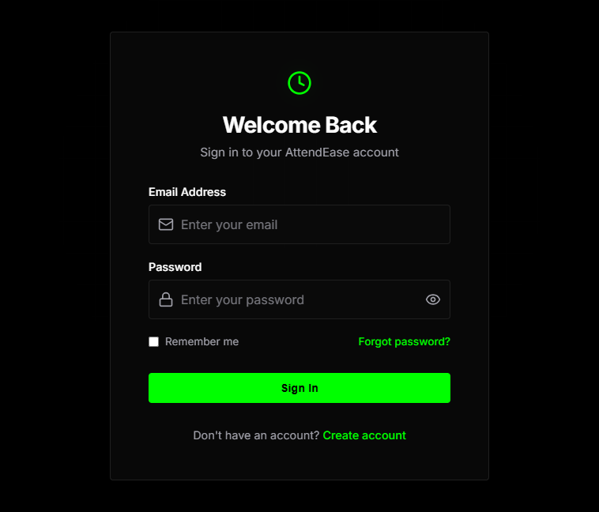
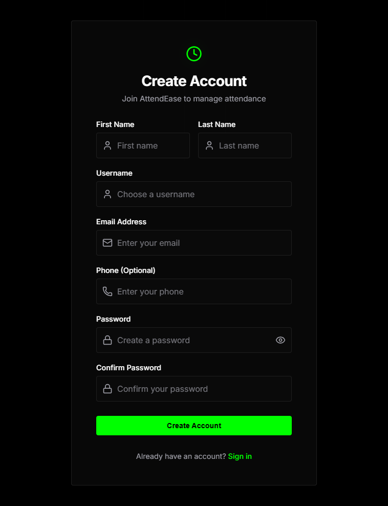
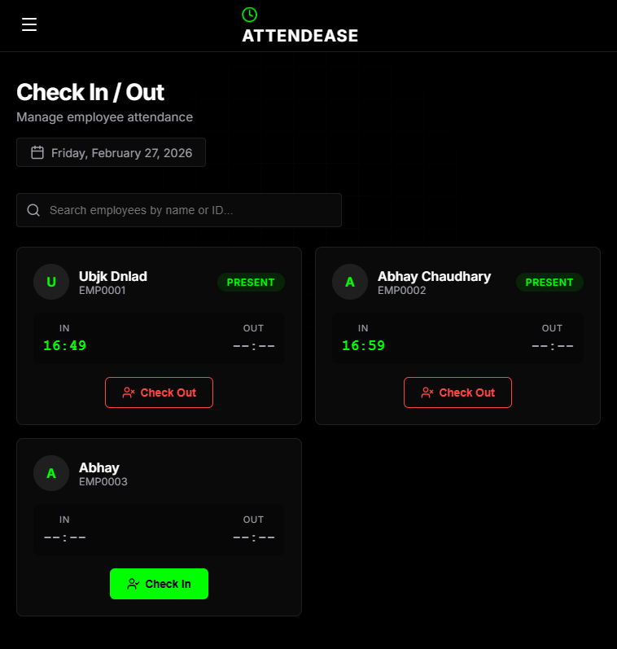
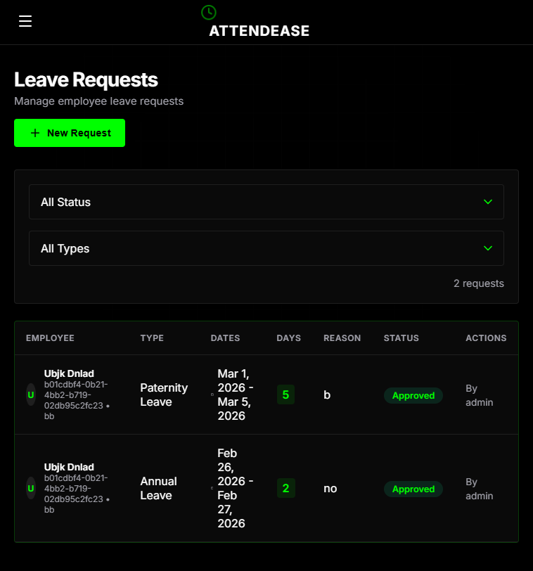

# AttendEase

<div align="center">



<h3>A Modern Employee Attendance Management System</h3>

<p>
  <strong>Streamline workforce management with real-time attendance tracking, leave management, and comprehensive analytics</strong>
</p>

<p>
  <a href="https://attendease-xi-two.vercel.app"><strong>Live Demo</strong></a>
  &nbsp;•&nbsp;
  <a href="https://attendease-pazn.onrender.com/api/docs"><strong>API Docs</strong></a>
  &nbsp;•&nbsp;
  <a href="#-quick-demo-access"><strong>Demo Credentials</strong></a>
</p>

<p>
  
  
  
  
</p>

</div>

---

> **Note:** If the app doesn't respond immediately, please wait a few minutes. The backend is hosted on Render and may take time to spin up from sleep mode.

---

## Demo Access

Experience both portals without setup:

### Admin Portal
| | |
|---|---|
| **Email** | `admin@attendease.com` |
| **Password** | `Admin@123` |
| **Access** | Full system control, employee management, attendance, leave approvals |

### Employee Portal
| | |
|---|---|
| **Action** | Click **Register** on the login page |
| **Access** | Personal check-in/out, leave requests, attendance history |

---

## Why AttendEase?

| Challenge | Solution |
|-----------|----------|
| Scattered attendance records | Centralized real-time dashboard |
| Manual leave approvals | Streamlined request workflow |
| No visibility into workforce | Analytics with trends & distribution |
| Complex HR systems | Clean, intuitive dual-portal design |

---

## Features

### For Administrators

| Feature | Description |
|---------|-------------|
| **Analytics Dashboard** | Real-time workforce statistics, 7-day attendance trends, distribution charts |
| **Employee Management** | Add, edit, delete employees with department assignment and status tracking |
| **Attendance Control** | Daily overview, manual check-in/out, status overrides, working hours |
| **Leave Management** | Approve/reject requests with comments, filter by status and type |
| **Department Management** | Organize workforce with department structure |

### For Employees

| Feature | Description |
|---------|-------------|
| **Personal Dashboard** | Own attendance stats and recent activity |
| **Quick Check-In** | One-click attendance with real-time status |
| **Leave Requests** | Submit and track leave requests with ease |

---

## Screenshots

All screenshots available at [`frontend/public/screenshots/`](frontend/public/screenshots/)

| | |
|:---:|:---:|
| **Login** | **Register** |
|  |  |
| **Dashboard** | **Check-In** |
|  |  |
| **Leave Requests** | |
|  | |

---

## Tech Stack

<table>
<tr>
<td width="50%">

### Frontend
- **React 18** - UI Library
- **Vite** - Build Tool
- **React Router** - Navigation
- **Axios** - HTTP Client
- **Lucide React** - Icons
- **Context API** - State

</td>
<td width="50%">

### Backend
- **FastAPI** - Python Framework
- **SQLAlchemy** - ORM
- **PostgreSQL** - Production DB
- **SQLite** - Development DB
- **JWT** - Authentication
- **Bcrypt** - Security

</td>
</tr>
</table>

---

## Architecture

```
┌─────────────────────────────────────────────────────────────┐
│                    FRONTEND (React + Vite)                   │
│                                                              │
│   Public Routes          Protected Routes      Admin Routes │
│   ─────────────          ────────────────      ──────────── │
│   • Login                • Dashboard           • Employees  │
│   • Register             • Check-In/Out        • Attendance │
│   • Password Reset       • Leave Requests      • Departments│
│                                                              │
└────────────────────────────┬────────────────────────────────┘
                             │ REST API
                             ▼
┌─────────────────────────────────────────────────────────────┐
│                    BACKEND (FastAPI)                         │
│                                                              │
│   Controllers  →  Services  →  Repositories  →  Models     │
│                                                              │
└────────────────────────────┬────────────────────────────────┘
                             │ SQLAlchemy
                             ▼
┌─────────────────────────────────────────────────────────────┐
│                    DATABASE                                  │
│            PostgreSQL (Prod) / SQLite (Dev)                 │
└─────────────────────────────────────────────────────────────┘
```

---

## Quick Start

### Prerequisites

- Python 3.11+
- Node.js 18+
- Git

### 1. Clone & Backend Setup

```bash
# Clone repository
git clone https://github.com/abhayror17/ATTENDEASE.git
cd ATTENDEASE/backend

# Create & activate virtual environment
python -m venv venv
source venv/bin/activate  # Linux/Mac
venv\Scripts\activate     # Windows

# Install dependencies & setup
pip install -r requirements.txt
cp .env.example .env
python -m app.scripts.db_init seed
python -m app.scripts.db_init superuser --email admin@example.com --username admin --password Admin@123

# Start server
uvicorn app.main:app --reload --port 8000
```

### 2. Frontend Setup

```bash
cd ../frontend
npm install
cp .env.example .env
npm run dev
```

### 3. Access

| Service | URL |
|---------|-----|
| Frontend | http://localhost:5173 |
| API Docs | http://localhost:8000/api/docs |
| Admin Login | `admin@example.com` / `Admin@123` |

---

## API Endpoints

| Category | Endpoint | Method | Description |
|----------|----------|--------|-------------|
| **Auth** | `/api/auth/login` | POST | User login |
| | `/api/auth/register` | POST | User registration |
| | `/api/auth/profile` | GET | Current user |
| **Employees** | `/api/employees` | GET/POST | List/Create |
| | `/api/employees/{id}` | GET/PUT/DELETE | Read/Update/Delete |
| **Attendance** | `/api/attendance/check-in` | POST | Check in |
| | `/api/attendance/check-out` | POST | Check out |
| | `/api/attendance/today` | GET | Today's records |
| **Leave** | `/api/leave-requests` | GET/POST | List/Create |
| | `/api/leave-requests/{id}/approve` | POST | Approve |
| | `/api/leave-requests/{id}/reject` | POST | Reject |

Full documentation: `/api/docs` (Swagger UI)

---

## Deployment

### Backend (Render)

| Step | Configuration |
|------|---------------|
| 1. Create PostgreSQL | Note the Internal Database URL |
| 2. Create Web Service | Connect GitHub repo |
| 3. Root Directory | `backend` |
| 4. Build Command | `chmod +x build.sh && ./build.sh` |
| 5. Start Command | `uvicorn app.main:app --host 0.0.0.0 --port $PORT` |

### Frontend (Vercel)

| Step | Configuration |
|------|---------------|
| 1. Import Project | Connect GitHub repo |
| 2. Root Directory | `frontend` |
| 3. Environment | `VITE_API_URL=https://your-backend.onrender.com/api` |

---

## Project Structure

```
ATTENDEASE/
├── backend/
│   ├── app/
│   │   ├── controllers/     # API endpoints
│   │   ├── services/        # Business logic
│   │   ├── repositories/    # Data access
│   │   ├── models.py        # Database models
│   │   ├── schemas.py       # Validation schemas
│   │   └── main.py          # Application entry
│   └── requirements.txt
│
├── frontend/
│   ├── src/
│   │   ├── pages/           # Page components
│   │   ├── components/      # Reusable UI
│   │   ├── context/         # State management
│   │   ├── api/             # API client
│   │   └── index.css        # Design system
│   └── package.json
│
└── README.md
```

---

## License

This project is licensed under the MIT License.

---

<div align="center">

<p>Built with AI assistance using GLM-5 and Gemini</p>

<p>
  <a href="https://attendease-xi-two.vercel.app">Live Demo</a>
  &nbsp;•&nbsp;
  <a href="https://github.com/abhayror17/ATTENDEASE/issues">Report Bug</a>
  &nbsp;•&nbsp;
  <a href="https://github.com/abhayror17/ATTENDEASE/issues">Request Feature</a>
</p>

</div>